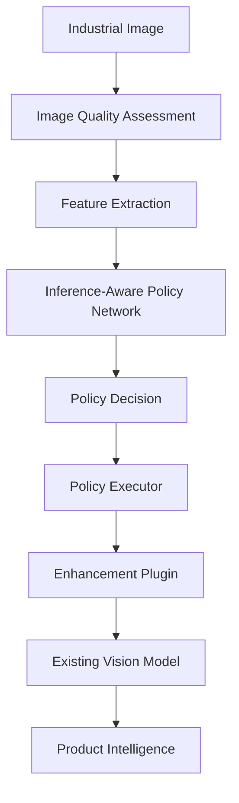

# Architecture Overview - VisionPilot AI

VisionPilot AI is an **AI-powered Inference Optimization Middleware** that predicts the optimal preprocessing strategy for industrial images before passing them to downstream AI vision models. By dynamically adjusting preprocessing parameters, it improves downstream vision reliability under volatile factory floor lighting and geometry conditions.

---

## Core Pipeline Architecture



### Module Responsibilities:

1. **Industrial Image Ingestion**: Accepts incoming frame streams from conveyors or cameras.
2. **Image Quality Assessment**: Analyzes overall pixel statistics (sharpness, noise, illumination skew).
3. **Feature Extraction**: Submodules isolate specific image features:
   - `brightness`: Computes light saturation.
   - `contrast`: Estimates dynamic range spans.
   - `blur`: Detects focal drift or vibration.
   - `noise`: Calculates high-frequency sensor noise.
   - `color_cast`: Identifies color temperature shifts.
   - `dynamic_range`: Highlights exposure highlight/shadow clipping.
   - `perspective`: Identifies geometric rotations.
4. **Inference-Aware Policy Network**: Uses extracted features to predict the preprocessing sequence that will yield maximum accuracy in the downstream models. It never directly executes plugins.
5. **Policy Executor**: Resolves the policy prediction, loads the registered enhancement plugins (such as HDR exposure blending or image straightening), and processes the image.
6. **Enhancement Plugins**: Swappable processing nodes inheriting from abstract interfaces.
7. **Existing Vision Model**: Receives optimized images for YOLO box detection and OCR reading.
8. **Product Intelligence**: Applies rules to determine final packaging PASS/FAIL metrics.

---

## Plugin Interface Design

To prevent changes to the Policy Network or Executor when introducing new algorithms (such as super resolution or reflection removal), all modules inherit from standard interfaces defined in `E:\VisionPilot_AI\backend\models\interfaces/`:

- **`EnhancementPlugin`**: Base class for any visual preprocessing.
- **`DetectorPlugin`**: Base class for swappable product detection engines.
- **`OCRPlugin`**: Base class for alphanumeric readers.

---

## Enhancement Plugin Architecture

Every visual preprocessing engine is decoupled from the middleware codebase by wrapping it inside an `EnhancementPlugin` subclass. The wrapper enforces input validation, catches processing exceptions, and reports standardized metadata without altering the underlying production algorithms.

### Standardized Plugin Metadata

Plugins expose metadata properties through standard interface methods:
- `get_plugin_name() -> str`: Unique identifier (e.g. `"HDR Fusion"`).
- `get_plugin_version() -> str`: Engine build version (e.g. `"MAWB-Net HDR Fusion V13.2"`).
- `get_plugin_description() -> str`: Functional summary description.
- `get_supported_formats() -> list`: Supported file extensions (e.g. `["jpg", "jpeg", "png", "tiff", "bmp"]`).
- `supports_batch_processing() -> bool`: Boolean compatibility flag.

### Standard Plugin Response Schema

All enhancement plugins return a standardized output schema upon execution:

```json
{
  "plugin": "HDR Fusion",
  "status": "success",
  "processing_time": 1.24,
  "input_image": "uploads/input_1783609.png",
  "output_image": "outputs/output_1783609.png",
  "metadata": {
    "version": "MAWB-Net HDR Fusion V13.2",
    "fusion_mode": "mertens",
    "simulated_brackets": true,
    "input_dimensions": "1920x1080",
    "output_dimensions": "1920x1080"
  }
}
```

---

## Plugin Registry Workflow

The global `PluginRegistry` serves as a dynamic lookup directory for available modules.
1. During initialization, active plugins (like `HDRFusionPlugin` and `ImageStraightenerPlugin`) register themselves in the registry database.
2. The REST API or the `PolicyExecutor` queries the registry dynamically instead of importing files directly, supporting runtime expansions.

### Plugin Health Monitoring

We expose the health status of all registered plugins via `GET /plugins/health`. The registry verifies that the wrapped production models compile and are loadable. If a model fails to import, it is labeled as `"Unhealthy"`, indicating missing dependencies or weights.

---

## Batch Processing Roadmap

To prepare the middleware for high-throughput industrial lines, we defined the `/enhance/batch` POST endpoint layout. The roadmap plans:
1. **Phase 3**: Integration of Celery worker queues with Redis to handle asynchronous bracket sets in parallel.
2. **Phase 4**: Parallel GPU pipeline scheduling using CUDA-based batch tensor execution.

